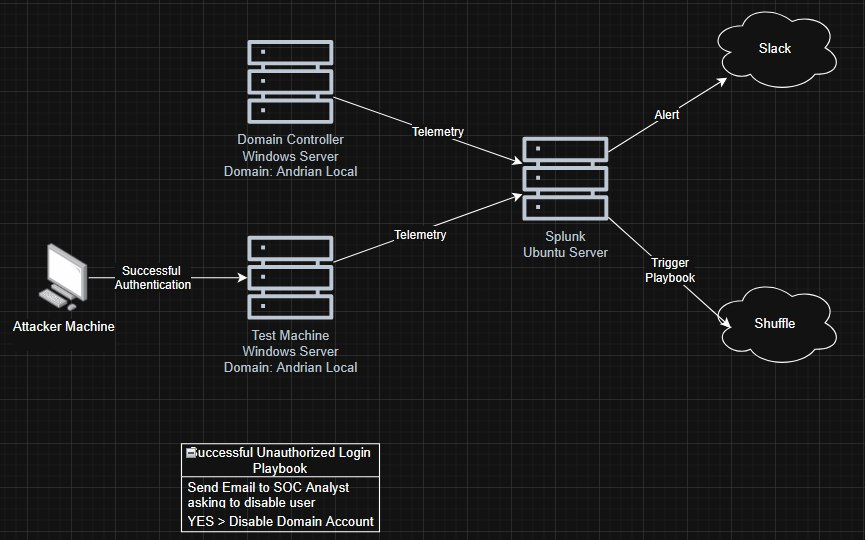

# Active Directory Project - Logical Diagram and IP Addressing

This document provides a visual overview of the project's network architecture and lists the IP address assignments for each virtual machine.

## Logical Diagram

Here is the logical diagram illustrating the network topology and the relationship between the different virtual machines.

## Machine IP Addresses

The following table lists the role, hostname, and assigned IP address for each virtual machine in the project. Please update the `IP Address` column with the static IP addresses you have configured.

| Machine Role | Hostname | IP Address | 
 | ----- | ----- | ----- | 
| **Domain Controller (DC)** | `DC-SERVER` | `[Your Domain Controller IP]` | 
| **Windows Client** | `CLIENT-PC` | `[Your Windows Client IP]` | 
| **Splunk Server** | `SPLUNK-SERVER` | `[Your Splunk Server IP]` |